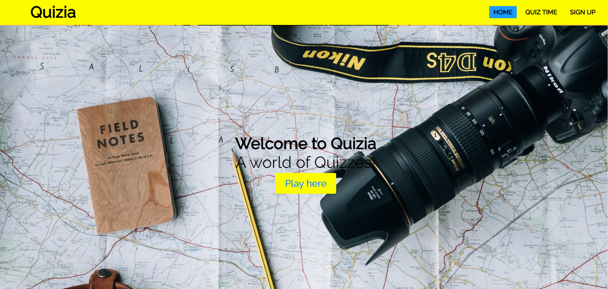
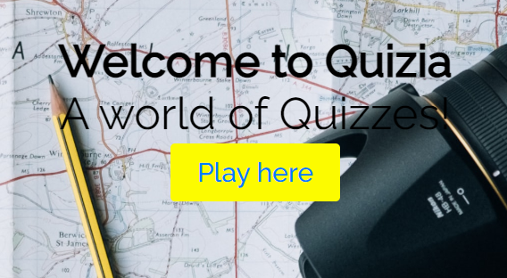
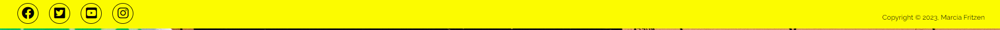
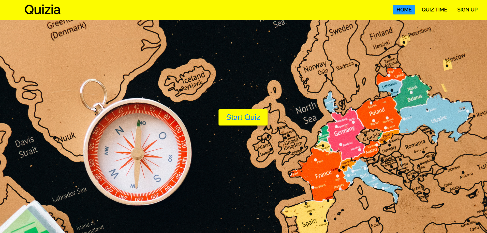
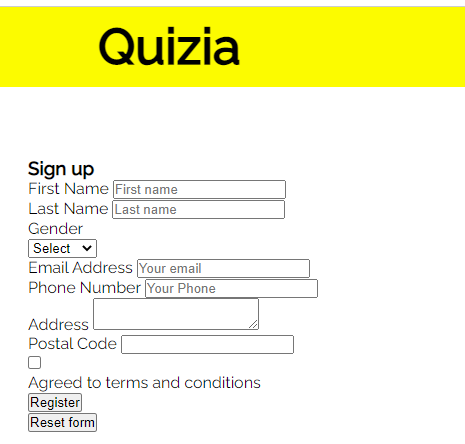
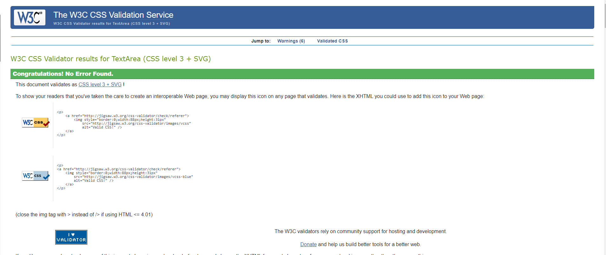

# Quizia

Quizia is a world of quizzes webstie. This website has been developed for travel lovers who wants to have fun and spend time and learn about the world.

     

# Creator

Marcia P Fritzen  
Code Institute Student,
2023

# Features

The application intends to attract users to play quiz online.

# Existing Features
# Navigation Bar

The navigation bar is featured on all four pages, with the Quiz name "Quizia" on the left corner with the logo and links to other pages of the website on the right. The links when clicked redirected to the respective pages. The full responsive navigation bar includes links to the Logo, Home page, Quiz page, About us and Sign Up page and is identical on each page to allow for easy navigation.

The navbar will allow the user to easily navigate from page to page across all devices without having to revert back to the previous page via the ‘back’ button.

# The landing page image
 
1. The landing page in the header section includes h1 heading.

2. Welcoming message using the color black.

3. Image to grab user's attention extracted from pexels.com.

5. There is also a call to action button redirecting to the Quiz page.

     

 
# The Footer
 
The footer provides users with a consistent point of reference/contact information that can be accessed on all pages of the website. The footer contains a copyright notice, link to social media icons (using font awesome icons). The link to social media redirects to a new tab when clicked.

 

    

# Quiz page
 
The Quiz page users will have access to an array of questions where they will select the right answers. Users have a time limit of 15 seconds to complete the quiz.
 

 

    

# Sign up page
 
This page includes a registration form with another level 3 heading where the user will need to complete the form informing personal details such as first name, last name, gender, email address, phone number, address, and postal code in order to sign up for the club. The form contains validation in HTML, so we cannot submit an empty form or enter a non-email address into an email address field.

 

    

# Features Left to Implement

1. More quizzes in the Quiz page separated by topics.
2. Travel videos page.
3. Travel blog page.

# Testing

Extensive testing has been performed and no major issues have been found. 

The site works at full capacity, and user friendly and intuitive. The users can easily navigate and achieve their goals without any trouble. 

The website is fully responsive and works well on different browsers such as Chrome, Firefox, and Safari and also on different screen sizes.

The forms available on the website contain validation in HTML, so there is no way users can submit an empty form or enter a non-email address into an email address field.

I confirmed that the navigation, header, about us, sign-up, and contact text are all readable and easy to understand.

# Bugs

When I deployed my project on github I found out that the video in the landing page was not working, I discovered this was due to the css path.

Fixed to:  <link rel="stylesheet" type="text/css" href="assets/css/style.css">

# Validator Testing

# HTML
No errors were returned when passing through the official W3C validator
 

    

# CSS
No errors were found when passing through the official (Jigsaw) validator
 

    

# Accessibility
I confirmed that the colors and fonts chosen are easy to ready and accessible by running lighthouse in devtools.

# Deployment

WonderlandTravelQuiz website was deployed to GitHub pages. The deployment steps taken:
1. Access GitHub repository WonderlandTravelQuiz 
2. Go to the Settings tab
3. From the source section drop-down menu, select the Master Branch
4. Once the master branch has been selected, the page will be automatically refreshed with a detailed ribbon display to indicate the successful deployment.
5. The live link can be found here - https://mpatricia22.github.io/WonderlandTravelQuiz/

# Credits

## Content

The icons in the footer were taken from Font Awesome.
The text extracted and inspired by:
https://www.sporcle.com/?refresh

## Media
All the photos included on project are from https://www.pexels.com/
Welcome #Quizia,

